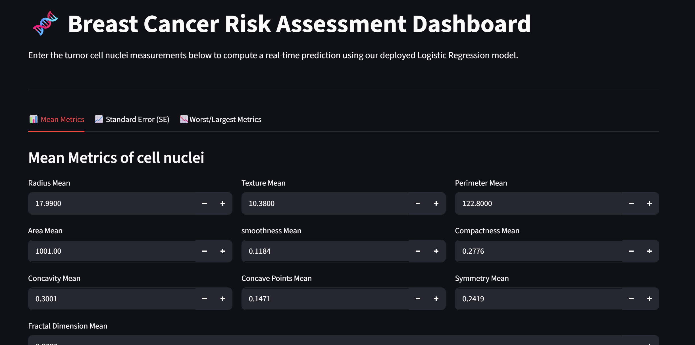

# Breast_cancer_detection_model
It can predict the chances of someone having breast cancer
# 🧬 Breast Cancer Risk Assessment Dashboard

An end-to-end MLOps application that hosts a trained Logistic Regression model to predict breast cancer tumor malignancy based on cell nuclei geometric metrics. The system features a modular architecture containing a highly responsive **FastAPI backend microservice** and an interactive **Streamlit frontend user interface**, packaged and containerized securely using **Docker**.

---

## 📊 Application Dashboard Preview



---

## 🏗️ System Architecture

The application is built using a decoupled microservices design patterns:

1. **Machine Learning Pipeline (`main.py`)**: Processed the Wisconsin Breast Cancer Dataset, handles feature scaling using `StandardScaler`, trains a `LogisticRegression` classifier, and exports the serialized model state.
2. **REST API Backend (`app.py`)**: Built with **FastAPI** and strict **Pydantic** data schemas. It receives client HTTP POST feature arrays, performs real-time scaling, executes model evaluation, and returns prediction statistics.
3. **Web Interface (`frontend.py`)**: Built with **Streamlit** to provide a clean, tabular UI layout categorized into Mean, Standard Error, and Worst metrics for effortless data entry.
4. **Containerization (`Dockerfile` & `start.sh`)**: Combines both microservices into a unified, lightweight Linux virtual environment network for portable, zero-dependency deployment.

---

## ⚙️ Setup & Installation

### Option 1: Native Local Development

1. **Clone the repository:**
   ```bash
   git clone [https://github.com/your-username/Breast_cancer_predictor.git](https://github.com/your-username/Breast_cancer_predictor.git)
   cd Breast_cancer_predictor
Set up your Python Virtual Environment:

PowerShell
python -m venv .venv
.venv\Scripts\Activate.ps1
Train and generate the model artifacts:

Bash
python main.py
Launch the backend server (Terminal 1):

Bash
python -m uvicorn app:app --reload
Launch the frontend dashboard (Terminal 2):

Bash
python -m streamlit run frontend.py
🐳 Option 2: Docker Enterprise Deployment (Recommended)
Ensure Docker Desktop is open and running on your system before executing these commands.

Compile the production container image (caches cleared):

PowerShell
docker build --no-cache -t breast-cancer-app:latest .
Launch the isolated environment:

PowerShell
docker run -d -p 8000:8000 -p 8501:8501 breast-cancer-app:latest
Access the live interfaces:

Streamlit Web App Dashboard: http://localhost:8501

Interactive FastAPI Swagger Documentation: http://localhost:8000/docs

🛠️ Technology Stack & Libraries
Core Language: Python 3.13

Frameworks: FastAPI, Streamlit

Machine Learning & Math: Scikit-Learn, Pandas, NumPy

Deployment Automation: Docker, Shell Scripting, Git